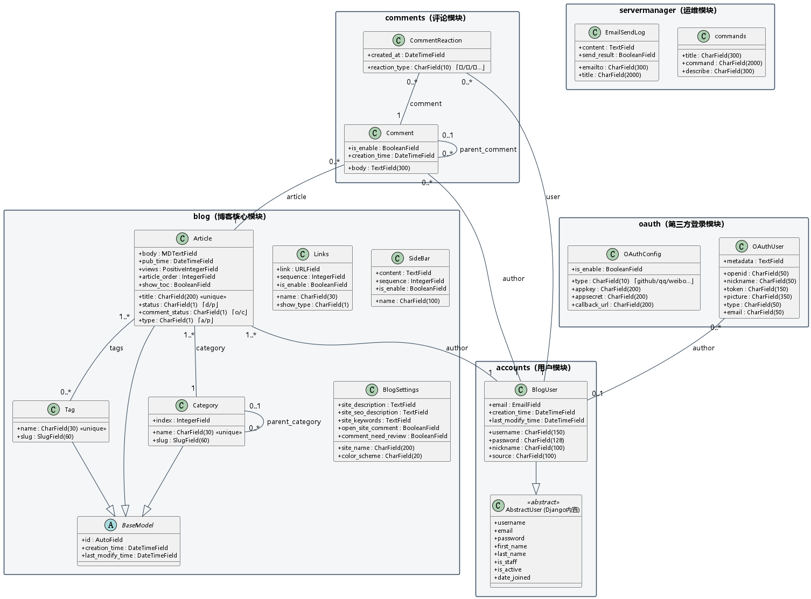

# DjangoBlog 数据模型（Model）类图分析

> 软工3班8组 · 第四周实践任务（路线图补充项：数据库与 model 的类图建模）
> 分析对象：`src/*/models.py`（accounts / blog / comments / oauth / servermanager）
> 配套产物：`数据模型类图.puml`（源文件）、`数据模型类图.png`（渲染图）

---

## 一、数据模型总览

DjangoBlog 采用 Django ORM，把业务数据划分在 5 个 app 中，共 **11 个模型类**，对应数据库 `djangoblog` 库中的表：

| app | 模型类 | 数据库表 | 职责 |
|-----|--------|----------|------|
| accounts | `BlogUser` | accounts_bloguser | 博客用户（继承 Django 内置 `AbstractUser`） |
| blog | `Article` | blog_article | 文章 / 页面 |
| blog | `Category` | blog_category | 文章分类（支持父子树形） |
| blog | `Tag` | blog_tag | 文章标签 |
| blog | `Links` | blog_links | 友情链接 |
| blog | `SideBar` | blog_sidebar | 侧边栏自定义 HTML 块 |
| blog | `BlogSettings` | blog_blogsettings | 站点全局配置（站名/副标题/配色等） |
| comments | `Comment` | comments_comment | 文章评论（支持回复） |
| comments | `CommentReaction` | comments_commentreaction | 评论 Emoji 反应/点赞 |
| oauth | `OAuthUser` | oauth_oauthuser | 第三方登录用户 |
| oauth | `OAuthConfig` | oauth_oauthconfig | 第三方登录应用配置 |
| servermanager | `commands` | servermanager_commands | 运维命令 |
| servermanager | `EmailSendLog` | servermanager_emailsendlog | 邮件发送日志 |

> 注：`blog.BaseModel` 为抽象基类（不建表），只提供 `id`、`creation_time`、`last_modify_time` 三个公共字段及自动生成 slug 的 `save()` 逻辑，供 `Article` / `Category` / `Tag` 继承复用。

---

## 二、核心模型字段说明

### 2.1 BlogUser（用户）
继承 Django `AbstractUser`，在原有 `username`/`email`/`password` 等字段之上扩展：

| 字段 | 类型 | 说明 |
|------|------|------|
| nickname | CharField(100) | 昵称 |
| source | CharField(100) | 账号来源 |
| creation_time / last_modify_time | DateTimeField | 创建/修改时间 |

### 2.2 Article（文章，核心表）
| 字段 | 类型 | 说明 |
|------|------|------|
| title | CharField(200)，unique | 标题（唯一） |
| body | MDTextField | 正文（Markdown） |
| pub_time | DateTimeField | 发布时间 |
| status | CharField(1) | 状态：d=草稿 / p=已发布 |
| comment_status | CharField(1) | 评论开关：o=开 / c=关 |
| type | CharField(1) | 类型：a=文章 / p=页面 |
| views | PositiveIntegerField | 浏览量 |
| show_toc | BooleanField | 是否显示目录 |
| article_order | IntegerField | 排序权重 |
| author | FK→BlogUser | 作者 |
| category | FK→Category | 所属分类（必填） |
| tags | M2M→Tag | 标签（多对多） |

### 2.3 Category / Tag（分类 / 标签）
- `Category`：`name`（唯一）、`parent_category`（自关联，构成树形分类）、`slug`、`index`（排序）。
- `Tag`：`name`（唯一）、`slug`。

### 2.4 Comment / CommentReaction（评论）
- `Comment`：`body`、`author`(FK→BlogUser)、`article`(FK→Article)、`parent_comment`（自关联，实现楼中楼回复）、`is_enable`（是否展示）。
- `CommentReaction`：`comment`(FK)、`user`(FK→BlogUser)、`reaction_type`（👍/❤️/🚀 等 8 种）、`created_at`；`unique_together` 保证同一用户对同一评论同一表情只能点一次。

### 2.5 BlogSettings（站点配置，单例表）
`site_name`、`site_description`、`site_seo_description`、`site_keywords`、`color_scheme`（8 套配色）、`open_site_comment`、`comment_need_review` 等；通过 `clean()` 约束全局仅一行，`save()` 后清缓存。

### 2.6 其他
- `Links`（友链）、`SideBar`（侧栏）、`OAuthUser`/`OAuthConfig`（第三方登录）、`commands`/`EmailSendLog`（运维）字段见类图。

---

## 三、关系分析

### 3.1 继承（泛化）关系
| 子类 | 父类 | 说明 |
|------|------|------|
| BlogUser | AbstractUser（Django 内置） | 复用 Django 认证用户体系并扩展昵称等字段 |
| Article / Category / Tag | BaseModel（抽象） | 复用主键与时间戳字段、slug 自动生成逻辑 |

### 3.2 关联关系（含多重性）
| 源 | 目标 | 关联字段 | 多重性 | 语义 |
|----|------|----------|--------|------|
| Article | Category | category | 1..* — 1 | 一个分类下有多篇文章，每篇文章必属一个分类 |
| Article | BlogUser | author | 1..* — 1 | 一个作者可写多篇文章 |
| Article | Tag | tags | 1..* — 0..* | 文章与标签多对多 |
| Comment | Article | article | 0..* — 1 | 一篇文章可有多条评论 |
| Comment | BlogUser | author | 0..* — 1 | 一个用户可发多条评论 |
| CommentReaction | Comment | comment | 0..* — 1 | 一条评论可有多个表情反应 |
| CommentReaction | BlogUser | user | 0..* — 1 | 一个用户可对多条评论表态 |
| OAuthUser | BlogUser | author | 0..* — 0..1 | 第三方账号可选绑定一个本地用户 |

### 3.3 自关联
- **Category.parent_category**：`0..1 — 0..*`，构成"技术 → 后端开发/前端开发/数据库"式的**树形分类**。
- **Comment.parent_comment**：`0..1 — 0..*`，实现评论的**楼中楼回复**结构。

---

## 四、UML 类图

下方为上述数据模型的 UML 类图（PlantUML 生成，源码见同目录 `数据模型类图.puml`）：

> 图例：三角空心箭头 `--|>` 表示**继承（泛化）**；实线箭头 `--` 表示**关联**，箭头两端标注多重性；`<<unique>>` 表示唯一约束；`「」` 内为该字段的取值枚举。
