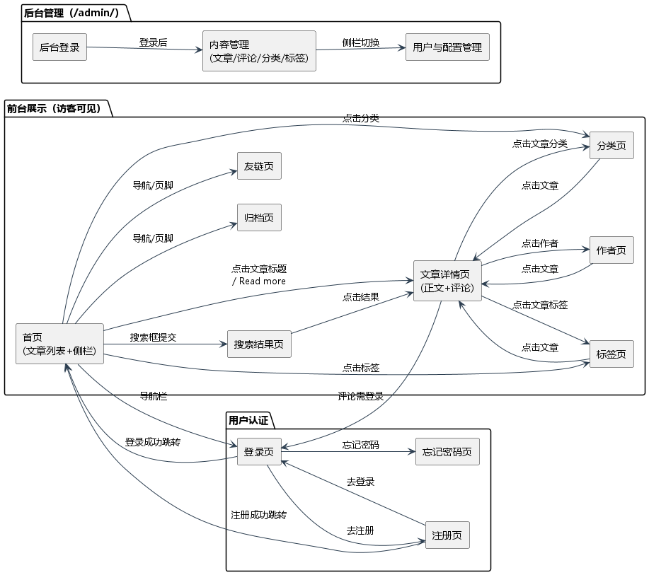

# DjangoBlog 界面设计分析

> 软工3班8组 · 第四周实践任务（任务②：界面设计与流转关系）
> 分析对象：运行中的「栈外」博客系统（Django 5.2 + MySQL）
> 配套产物：`界面截图/`（10 张界面截图）、`界面流转关系图.puml/.png`

---

## 一、界面总览

系统界面分为**前台展示**、**用户认证**、**后台管理**三大块，共梳理出 10 个核心界面：

| 编号 | 界面 | 访问路径 | 截图文件 |
|------|------|----------|----------|
| 1 | 首页 | `/` | 01_首页.png |
| 2 | 文章详情页 | `/article/<year>/<month>/<day>/<id>.html` | 02_文章详情.png |
| 3 | 分类页 | `/category/<slug>.html` | 03_分类页_技术.png |
| 4 | 标签页 | `/tag/<slug>.html` | 04_标签页_Python.png |
| 5 | 归档页 | `/archives.html` | 05_归档页.png |
| 6 | 登录页 | `/login/` | 06_登录页.png |
| 7 | 注册页 | `/register/` | 07_注册页.png |
| 8 | 搜索结果页 | `/search?q=关键词` | 08_搜索页.png |
| 9 | 后台管理登录 | `/admin/login/` | 09_后台管理登录.png |
| 10 | 友链页 | `/links.html` | 10_友链页.png |

---

## 二、各界面功能说明

### 2.1 首页（`/`）
系统入口，聚合展示最新文章。核心元素：顶部导航栏（站名「栈外」/分类导航/登录入口）、文章卡片列表（标题、摘要、`Read more`）、侧边栏（热门文章 VIEWS、分类等）、页脚（归档/友链入口）。

### 2.2 文章详情页（`/article/…/<id>.html`）
单篇文章的完整展示。核心元素：文章标题、浏览量、评论数、发布时间、正文（Markdown 渲染）、文章标签、作者、上一篇/下一篇导航、评论区。

### 2.3 分类页（`/category/<slug>.html`）
按分类聚合文章，展示该分类下的文章列表；支持分类树（技术 → 后端开发/前端开发/数据库）。

### 2.4 标签页（`/tag/<slug>.html`）
按标签聚合文章，展示打了同一标签的文章列表。

### 2.5 归档页（`/archives.html`）
按时间归档全部文章，便于按月份浏览。

### 2.6 登录页（`/login/`）
用户账号密码登录；提供「忘记密码」「去注册」入口；登录成功后跳转首页。

### 2.7 注册页（`/register/`）
新用户注册；注册成功后跳转首页。

### 2.8 搜索结果页（`/search?q=…`）
根据关键词全文检索文章，展示匹配结果列表。

### 2.9 后台管理（`/admin/`）
Django 自带管理后台，登录后管理文章、评论、分类、标签、用户、站点配置（站名/副标题/配色等）。

### 2.10 友链页（`/links.html`）
展示友情链接列表。

---

## 三、界面流转关系

### 3.1 流转关系图



### 3.2 核心流转路径

1. **首页 → 文章详情**：点击文章标题或 `Read more`；
2. **首页 → 分类页 / 标签页**：点击文章卡片上的分类名 / 标签名，或顶部导航；
3. **首页 → 归档页 / 友链页**：页脚导航；
4. **首页 → 搜索**：顶部搜索框提交关键词，进入搜索结果页 → 再进入文章详情；
5. **文章详情 → 分类 / 标签 / 作者**：点击文章正文上方的分类、标签或作者名；
6. **登录 ↔ 注册**：两页互相跳转；登录/注册成功后均跳转首页；
7. **后台**：`/admin/` 未登录时跳转到 `/admin/login/`，登录后进入内容管理。

### 3.3 思维导图（界面层级结构）

```text
栈外博客系统
├── 前台展示（访客可见）
│   ├── 首页（文章列表 + 侧栏）
│   ├── 文章详情页（正文 + 评论）
│   ├── 分类页（分类树）
│   ├── 标签页
│   ├── 归档页
│   ├── 友链页
│   └── 搜索结果页
├── 用户认证
│   ├── 登录页
│   ├── 注册页
│   └── 忘记密码页
└── 后台管理（/admin/）
    ├── 后台登录
    ├── 内容管理（文章/评论/分类/标签）
    └── 用户与配置管理（用户/站点配置）
```

---

## 四、界面元素与参考样例对照

对照教师给出的「博客主题实例化参考」样例，本系统已具备同等完整的界面元素：

| 参考样例元素 | 本系统对应位置 |
|--------------|----------------|
| 首页文章列表 | 首页文章卡片 |
| 文章标题/评论数/浏览量 | 文章详情页顶部 meta |
| 正文 + Read more | 文章详情页正文 + 首页卡片 `Read more` |
| 分类（旅游/日常/家庭/宠物） | 分类树（技术/生活及其子分类） |
| 侧栏 VIEWS（热门文章） | 首页侧边栏「热门文章」 |
| 搜索框 + 提交按钮 | 顶部搜索框 |
| 文章归档 | 归档页 `/archives.html` |

> 说明：参考样例为「生活向」主题，本组主题为「技术+生活」的个人技术博客「栈外」，界面元素完全一致，只是内容定位不同（技术文章 + 生活随笔）。
