# 「栈外」软件系统的界面设计

**组号：** 8（软工3班8组）
**小组成员：** 张月、黄梓涵、侍文博、刘雨婷、谢承志、朱亮宇

---

## 一、软件系统概述

我们组选用的是开源项目 **DjangoBlog**——一个基于 Python + Django 的个人博客系统。组会上讨论后，我们把它做成了一个叫「栈外」的技术博客，副标题"栈里写码，栈外生活"，意思是既要记录技术学习和开发过程，也顺手分享点生活日常。

简单来说，这个系统解决的是"让一个人能轻松写博客"这件事：作者不用关心底层怎么实现，就能完成写文章、发文章、分类归档、打标签、评论互动、全文搜索这一整套事情，再通过后台统一管理内容。

系统用的是 MVT（Model-View-Template）架构：前端用 Vite + Tailwind 做的界面（深色主题、响应式、Markdown 渲染和代码高亮），后端 Django 负责业务逻辑，数据存在 MySQL 里。

---

## 二、功能分析

按主要功能罗列如下：

| 序号 | 功能模块 | 功能说明 |
|------|----------|----------|
| 1 | 文章发布与管理 | 后台创建/编辑/发布文章，支持 Markdown 写作、代码高亮、文章目录（TOC） |
| 2 | 分类与标签 | 分类树（父子层级）+ 标签体系，对文章进行多维归类与聚合 |
| 3 | 评论系统 | 文章评论、楼中楼回复、Emoji 反应（👍/❤️/🚀 等 8 种）、评论审核 |
| 4 | 用户与认证 | 注册、登录、忘记密码、第三方（OAuth）登录 |
| 5 | 全文搜索 | 按关键词检索文章（标题与正文），展示搜索结果 |
| 6 | 归档与友链 | 按时间归档文章、友情链接展示 |
| 7 | 站点配置 | 站名、副标题、SEO 关键词、配色方案、备案号等全局配置 |
| 8 | 订阅输出 | RSS / Feed 输出，供阅读器订阅 |

---

## 三、软件主要的界面设计

### 3.1 首页

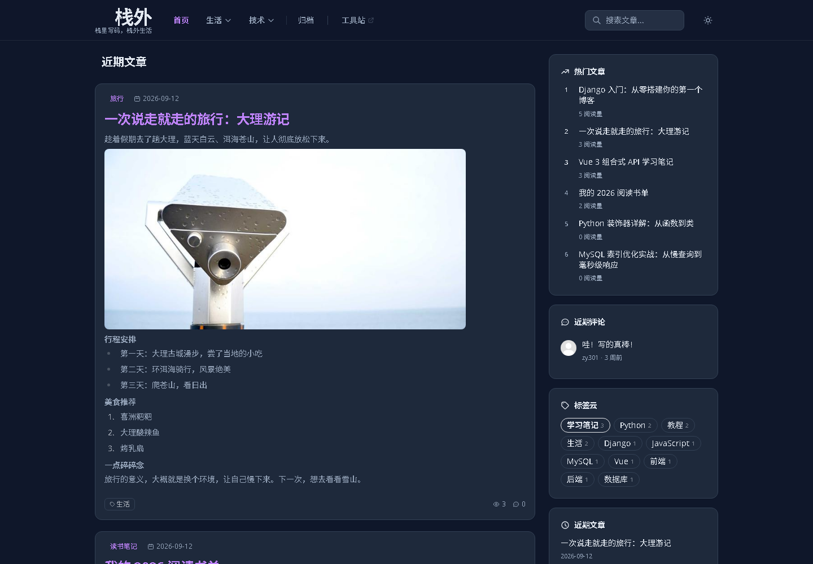{width=85%}

**核心界面元素：**

| 元素 | 位置 | 功能 |
|------|------|------|
| 顶部导航栏 | 页首 | 显示站名「栈外」、分类导航、登录/注册入口 |
| 文章卡片列表 | 主区域 | 展示最新文章（标题、摘要、`Read more`） |
| 侧边栏 | 右侧 | 展示热门文章（VIEWS）、分类等聚合信息 |
| 搜索框 | 顶部 | 输入关键词进行全文搜索 |
| 页脚 | 页尾 | 归档、友链入口及版权信息 |

### 3.2 文章详情页

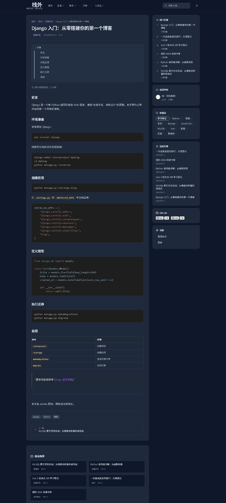{width=85%}

**核心界面元素：**

| 元素 | 功能 |
|------|------|
| 文章标题 | 显示文章标题 |
| 元信息区 | 显示浏览量、评论数、发布时间、作者 |
| 正文区 | Markdown 渲染的文章正文，支持代码高亮 |
| 标签区 | 展示文章所属标签，可点击跳转标签页 |
| 评论区 | 发表评论、楼中楼回复、Emoji 反应 |

### 3.3 分类页

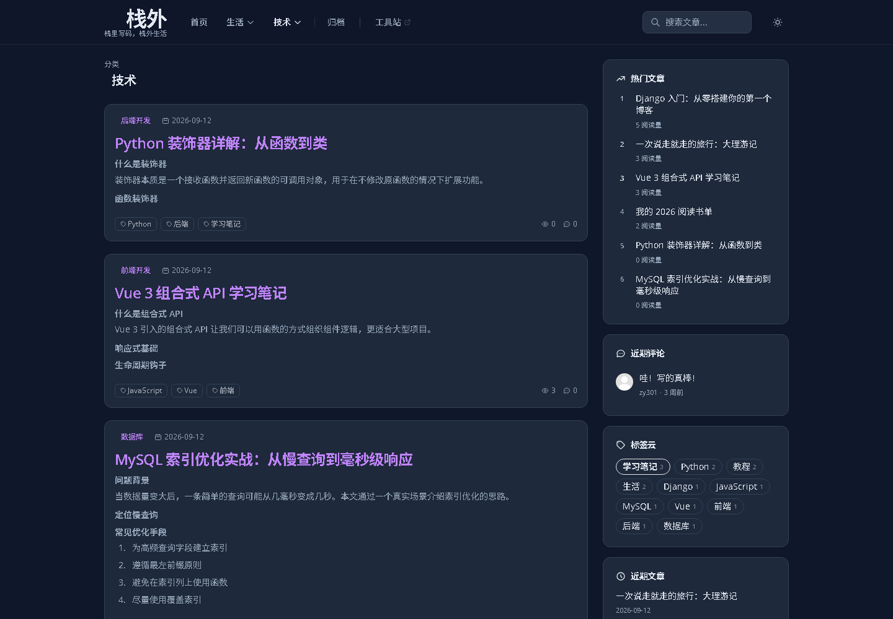{width=85%}

按分类聚合文章，支持分类树（技术 → 后端开发 / 前端开发 / 数据库）。

### 3.4 标签页

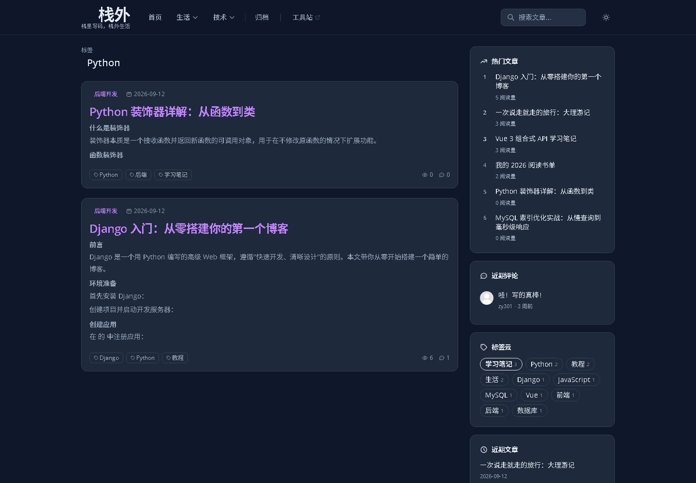{width=85%}

按标签聚合文章，展示打了同一标签的文章列表。

### 3.5 归档页

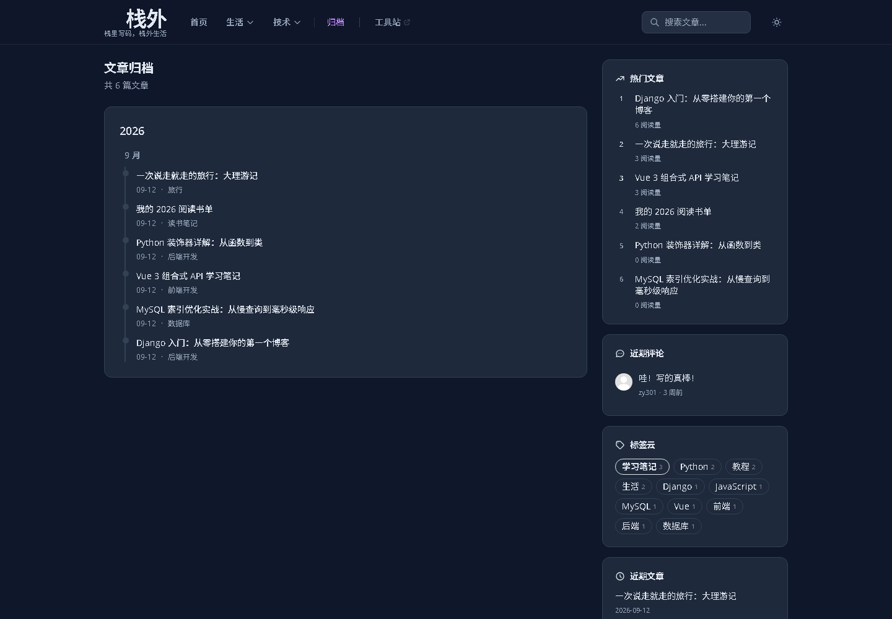{width=85%}

按时间归档全部文章，便于按月份浏览。

### 3.6 友链页

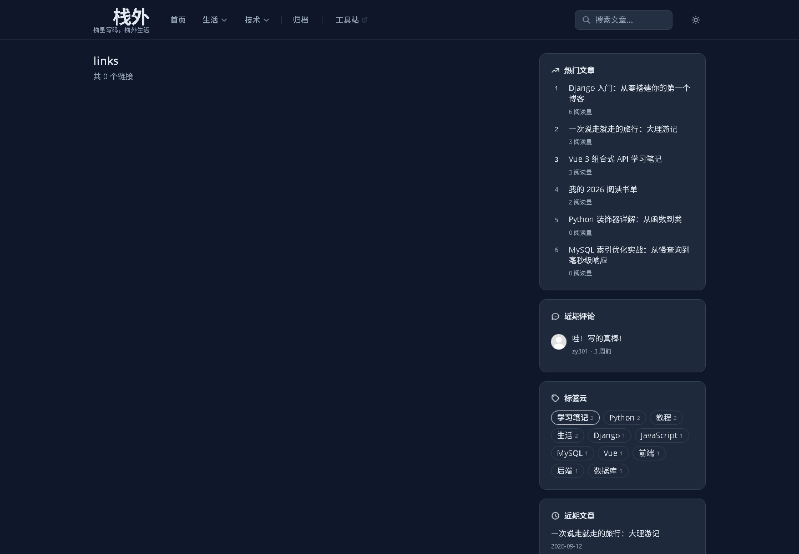{width=85%}

展示友情链接列表。

### 3.7 登录页

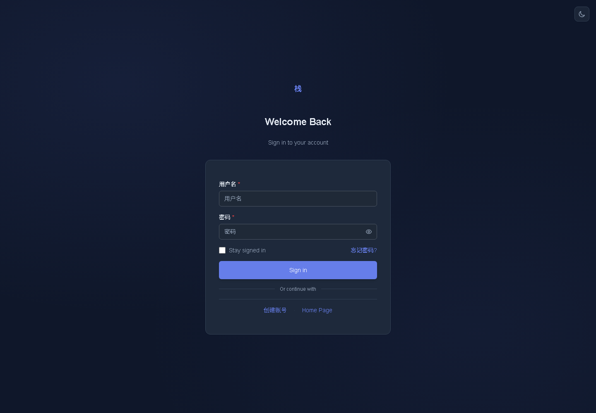{width=85%}

账号密码登录，提供"忘记密码""去注册"入口，登录成功后跳转首页。

### 3.8 注册页

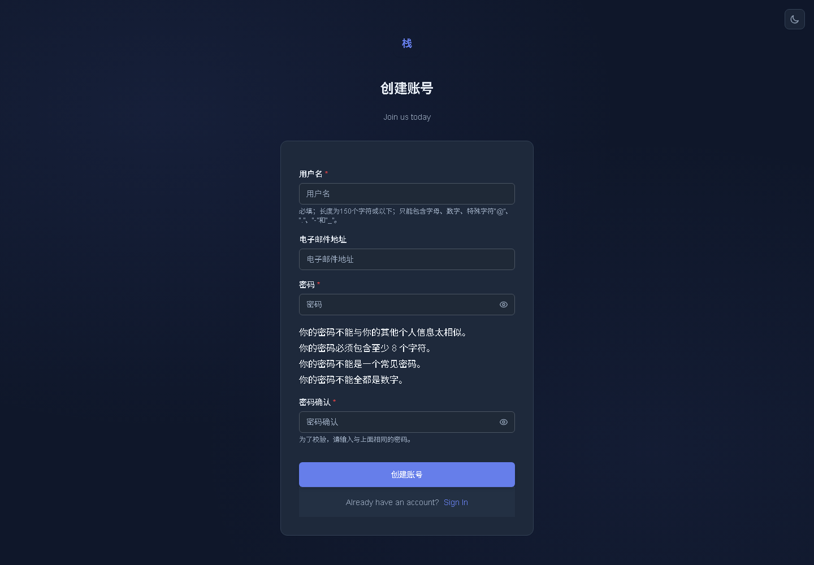{width=85%}

新用户注册，注册成功后跳转首页。

### 3.9 搜索结果页

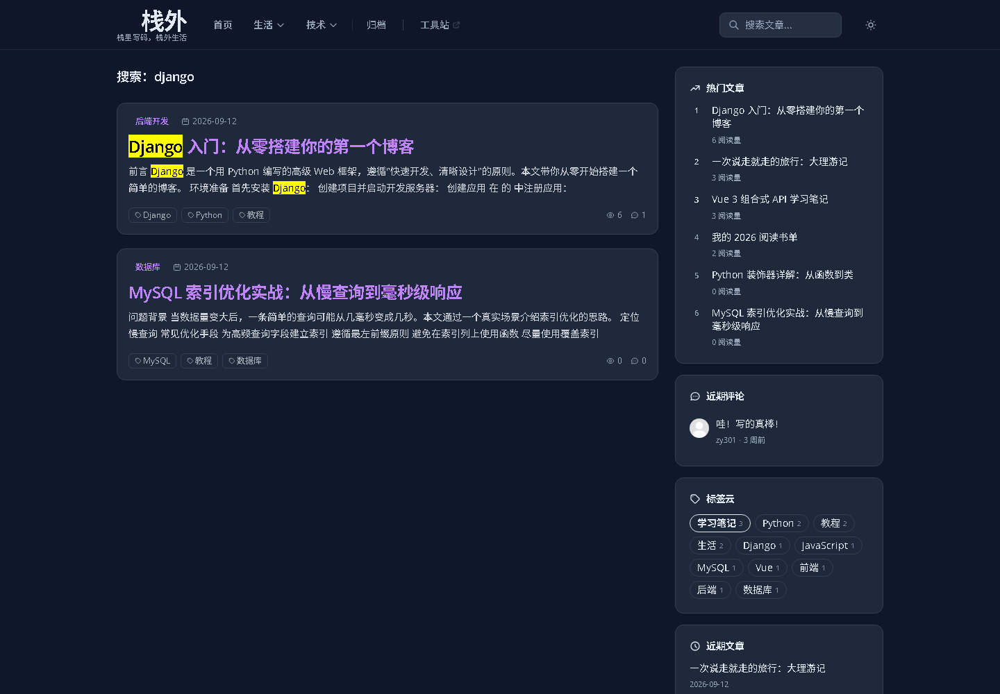{width=85%}

根据关键词全文检索文章，展示匹配结果列表。

### 3.10 后台管理

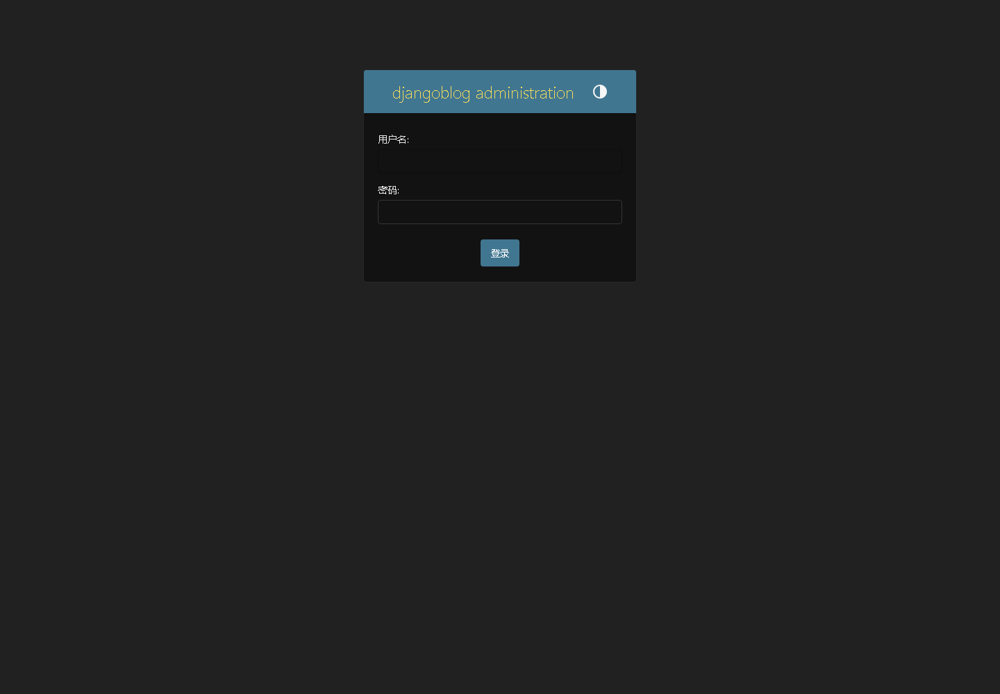{width=85%}

Django 自带管理后台（`/admin/`），登录后管理文章、评论、分类、标签、用户及站点配置。

### 3.11 界面流转关系

{width=90%}

主要流转路径：首页 → 文章详情（点击文章/Read more）；首页 → 分类/标签页（点击分类/标签）；文章详情 → 分类/标签/作者页；首页 → 搜索 → 文章详情；登录/注册成功后跳转首页；`/admin/` 未登录时跳转后台登录页。

---

## 四、模板设计

### 4.1 模板与界面的对应关系

DjangoBlog 采用 MVT 中的 T（Template）层组织界面，`src/templates/` 下按功能划分为多个模板包，每个界面由对应模板渲染：

| 界面 | 对应模板 | 所属模板包 |
|------|----------|------------|
| 首页 | `blog/article_index.html` | blog |
| 文章详情页 | `blog/article_detail.html` | blog |
| 分类页 | `blog/category.html` | blog |
| 标签页 | `blog/tag.html` | blog |
| 归档页 | `blog/article_archives.html` | blog |
| 登录页 | `account/login.html` | account |
| 注册页 | `account/registration_form.html` | account |
| 搜索结果页 | `search/search.html` | search |

### 4.2 模板继承、包含及与 tag 的关系

模板通过三种机制复用页面结构：

1. **继承（``）**：页面模板继承两个根布局模板——全站主布局 `share_layout/base.html`（导航 + 内容 + 侧栏 + 页脚）与账号布局 `share_layout/base_account.html`；
2. **包含（``）**：`base.html` 包含 `nav.html`、`footer.html` 等片段，文章详情页包含评论片段；
3. **模板与 tag（inclusion_tag）**：自定义标签库（`blog_tags.py`、`comments_tags.py`、`oauth_tags.py` 等）通过 `inclusion_tag` 机制，把"数据准备逻辑"与片段模板绑定，标签被调用时自动渲染对应片段模板（如侧栏、面包屑、分页、文章卡片等）。

### 4.3 UML 包图

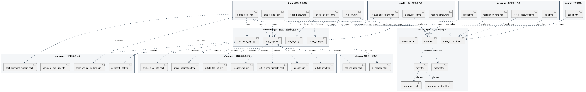{width=100%}

上图为模板之间继承、包含、标签渲染、加载关系的 UML 包图（PlantUML 生成，源码见同目录 `模板关系包图.puml`）。

> 图例：`<<extends>>` 继承（泛化）、`<<include>>` 包含、`<<render>>` inclusion_tag 渲染、`<<load>>` 标签库加载。

**关系文字说明：** 全站页面以 `base.html`、`base_account.html` 两个根布局为骨架，8 个页面继承 `base.html`，4 个账号相关页面继承 `base_account.html`；`base.html` 通过 `include` 拼装导航与页脚；博客各页面的侧栏、面包屑、分页、文章卡片等动态片段由 `blog_tags.py` 的 inclusion_tag 渲染，评论区由 `comments_tags.py` 渲染，OAuth 应用列表由 `oauth_tags.py` 渲染；页面模板通过 `` 声明对上述标签库的依赖。

---

*附：数据模型类图见同目录《数据模型类图分析.md》，模板关系详细分析见同目录《模板继承包含关系分析.md》。*
